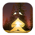

#  Starfall

You are a star fallen on the Earth. You find yourself in a dark forest looking for the way home. You are very weak. Catch all the glows to get your energy back and fly. But careful, avoid the black holes along the way trying to absorb you!

Starfall is an free endless runner game, If you wish the story to continue, download and share! ;-)

Features:
- A complete level with increasing difficulty
- Three challenging elements: glows captured, fly time, game time
- Original soundtrack
- Handmade graphic

The game is entirely **free** and open source: I didn't use any third party library to track or log user events. There are no ads too.

I coded this game with these libraries:
- [MonoGame](https://github.com/MonoGame)
- [FbonizziMonoGame](https://github.com/FrancescoBonizzi/FbonizziMonoGame)

---

If you like my work, please consider to [offer me an espresso!](https://www.paypal.com/cgi-bin/webscr?cmd=_donations&business=DTT7P8N3TV7N6&currency_code=EUR&source=url) ;-)
