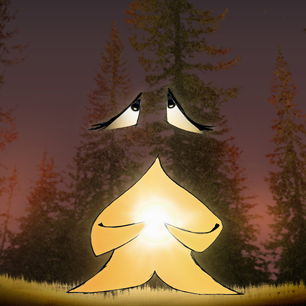
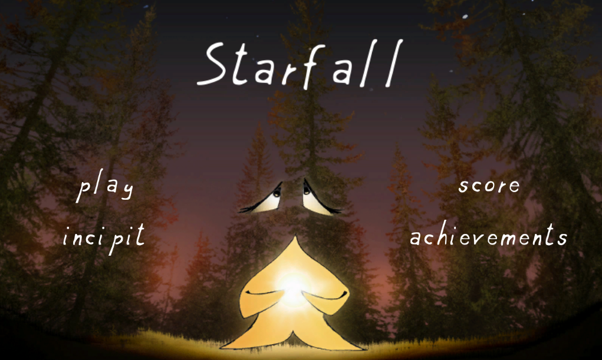
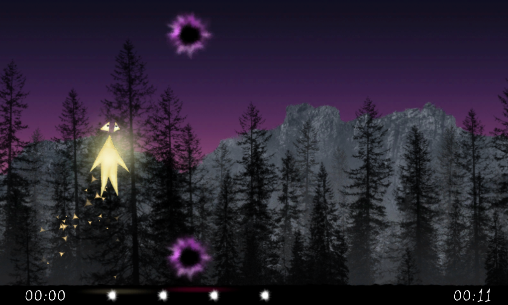
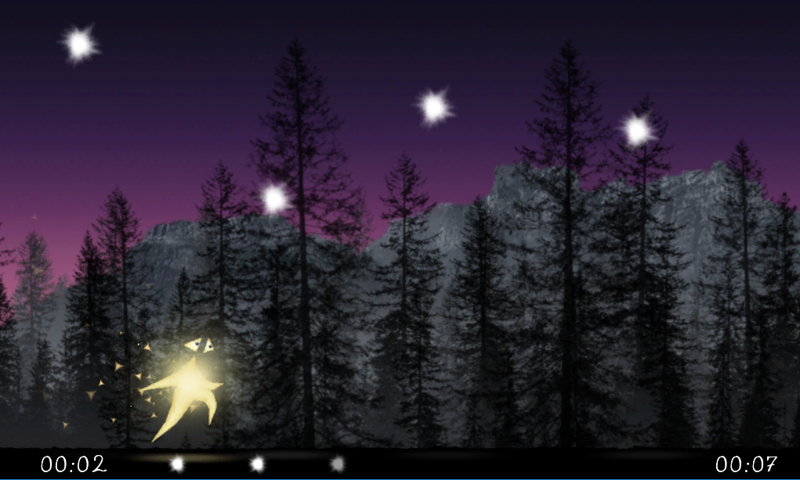

# Starfall

[Gioca ora sul web](https://imaginesoftware.it/open-source-projects/starfall)

Sei una stella caduta sulla Terra. Ti ritrovi in una foresta oscura alla ricerca della strada di casa. Sei molto debole: raccogli tutte le luci per recuperare energia e tornare a volare. Ma fai attenzione ai buchi neri lungo il percorso, che cercano di assorbirti.

Starfall e un endless runner gratuito. Se vuoi che la storia continui, giocaci e condividilo.

## Caratteristiche

- Un livello completo con difficolta crescente
- Tre elementi di sfida: luci raccolte, tempo di volo, tempo di gioco
- Colonna sonora originale
- Grafica realizzata a mano

## Screenshot

---

Il gioco è completamente **gratuito** e open source: non uso librerie di terze parti per tracciare o registrare eventi utente e non ci sono pubblicita.

Ci sono due versioni:

1. Versione CSharp, che trovi nella cartella `CSharp`.

   Ho sviluppato questa versione (Android, Windows...) con queste librerie:
   - [MonoGame](https://github.com/MonoGame)
   - [FbonizziMonoGame](https://github.com/FrancescoBonizzi/FbonizziMonoGame)

2. Versione Web, che puoi giocare [qui](https://imaginesoftware.it/open-source-projects/starfall).

   Ho sviluppato questa versione con [PixiJS](https://pixijs.com/). **Supportero solo questa**.

---

Se apprezzi il mio lavoro, puoi [offrirmi un espresso](https://www.paypal.com/cgi-bin/webscr?cmd=_donations&business=DTT7P8N3TV7N6&currency_code=EUR&source=url).
